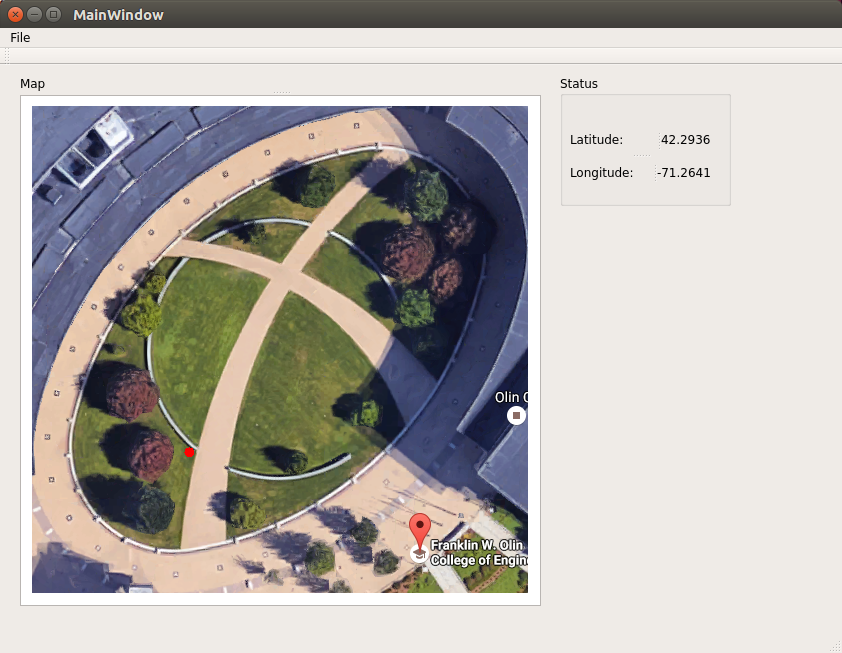

# FunRobo-GPSViewer



[Youtube Link](https://youtu.be/9j7yDv_H1Ng)

GPS Visualization Package for ENGR3390 : Fundamentals of Robotics Class at Olin College.

## Usage

Building this package requires the installation of Qt5.
At this point, it has been tested with [Qt 5.7](https://www.qt.io/qt5-7/).
and also the QT5 version distributed via package manager (apt-get).

## Install Dependencies:

``` bash
sudo apt-get install qtbase5-dev
```

```bash
rosrun funrobo_gpsview gpsview
```

## Demo:

To Replay the recorded ROSbag:

```bash
rosbag play gps-test.bag
```

Then run the visualization node.

During the testing, I went around the oval starting at the entrance to the campus center, returned to the spot, and cut across the oval until the center, then turned right towards the right entrance of the academic center, when I terminated the session.
